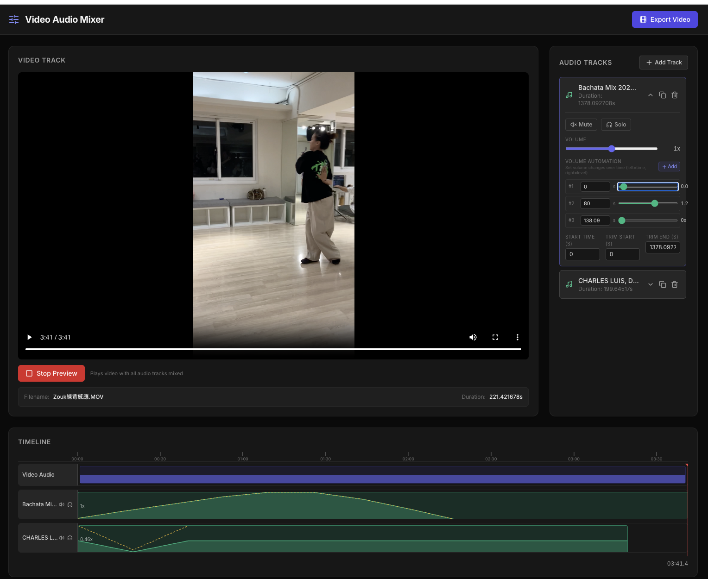

# Video Audio Remixer

> Important: Before working on this project, read [AGENTS.md](AGENTS.md) for required workflows and tooling expectations.


## Getting Started

> Before making changes, read the project guidelines in [AGENTS.md](AGENTS.md).

This project is managed with [Poetry](https://python-poetry.org/).

### Prerequisites

Based on this project's dependencies, install the following system-level packages first via Homebrew (macOS):

```bash
brew install python@3.11 ffmpeg poetry
```

| Package | Reason |
|---------|--------|
| `python@3.11` | The project requires Python ~3.11 as specified in `pyproject.toml` |
| `ffmpeg` | Required by `moviepy` for video cutting, merging, and transcoding |
| `poetry` | Python dependency manager used to manage this project |

After installing Playwright (via `poetry install`), you also need to download browser binaries:

```bash
poetry run playwright install
```

### Installation

1. Ensure Poetry uses Python 3.11:

```bash
poetry env use python3.11
poetry env info
```

2. Install dependencies:

```bash
poetry install
```

### Running the App

Start the development server:

```bash
poetry run ./reflex_rerun.sh
```

The application will be available at `http://localhost:3000`.

### Clean Rebuild & Run

To fully clean the environment, reinstall all dependencies, and start the app in one step:

```bash
./proj_reinstall.sh --with-rerun
```

This will remove existing Poetry virtual environments and Reflex artifacts, recreate the environment from scratch, and automatically launch the app afterwards.


## Screenshot



## Usage Guide

### 1. Upload a Video
- Drag and drop a video file (MP4, MOV, MKV, WEBM) onto the **Video Track** area, or click to browse.
- Once uploaded, the video preview and timeline will appear.

### 2. Add Audio Tracks
- Click **+ Add Track** in the **Audio Tracks** panel on the right, then choose **From Computer** or **From YouTube**.
- **From Computer** lets you upload local audio files (MP3, WAV, OGG, or M4A).
- **From YouTube** lets you paste a URL and automatically converts the video to MP3 before adding it as a track.
- Multiple audio tracks can be layered on top of the video.

### 3. Edit Audio Tracks
Each audio track supports the following controls:
- **Volume Slider** — Adjust the base volume (0x – 2x).
- **Mute / Solo** — Mute a track or solo it (only hear that track).
- **Start Time** — Set when the audio begins playing relative to the video.
- **Trim Start / Trim End** — Trim the audio to use only a portion of the file.
- **Duplicate / Delete** — Clone or remove a track.

### 4. Volume Automation (Keyframes)
- Expand a track and use the **Volume Automation** section to add keyframes.
- Click **+ Add** to create a keyframe at a specific time with a target volume.
- Keyframes are linearly interpolated — the volume smoothly transitions between them.
- The timeline shows the envelope visualization:
  - **Green area / line** — Effective volume (base volume × automation envelope).
  - **Yellow dashed line** — Automation envelope ceiling (keyframe values only).

### 5. Timeline Navigation
- **Click** anywhere on the timeline ruler or tracks area to seek to that position.
- **Drag** the ruler to scrub through the video and audio in real time.
- The red playhead and current time display update as you navigate.

### 6. Preview Mix
- Click **Preview Mix** to play the video with all audio tracks mixed together.
- Volume, mute, solo, and automation changes are applied in real time during preview.
- Dragging the timeline during preview repositions both video and all audio tracks.
- Click **Stop Preview** to pause playback.

### 7. Export Video
- Click **Export Video** to render the final video with all audio tracks mixed in.
- The export uses FFmpeg to merge video and audio with volume automation applied.


